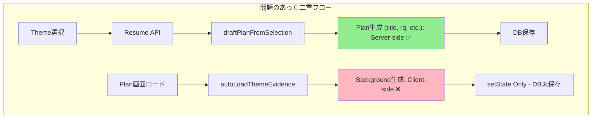

# Data Flow Consistency: Theme→Plan Background Field Issue

本ドキュメントは、2025-08-29に発生したTheme→Plan間でのBackground field未反映問題について、根本原因、解決策、および将来の類似問題防止策をまとめたものです。

## 問題の概要

**現象**: Theme exploration で取得した論文データやdeep researchの結果が、Plan ページの Background / Prior Work フィールドに反映されない

**影響**: ユーザーが手動でテーマ選択 → Plan作成フローを完了しても、重要なエビデンス情報が活用されない

## 根本原因分析

### 1. データフロー構造の分離問題



**根本問題**: `Background`フィールドだけが他のフィールドと**異なるライフサイクル**で処理されていた

### 2. Type Definition の不整合

```typescript
// ❌ 問題のあった定義
export type DraftPlan = {
  title: string;
  rq: string;
  hypothesis: string;
  // ... 他のフィールド
  ethics: string;
  // background: string; ← 存在しない！
};

// Plan ページでは background を期待
type Plan = {
  // ... 他のフィールド
  background?: string; ← 型定義に存在するが生成ロジック不在
};
```

**問題**: 型定義間の不整合により、一部フィールドが**生成されない**状態が発生

### 3. 永続化パターンの一貫性欠如

| フィールド | 生成タイミング | 永続化方法 | 結果 |
|------------|----------------|------------|------|
| title, rq, hypothesis等 | Resume時 | DB直接保存 | ✅ 確実 |
| background | Plan画面ロード時 | setState のみ | ❌ 揮発的 |

## 解決策の実装

### 1. 統一データフロー化

```typescript
// ✅ 修正後: 全フィールドが同一フローで生成
const plan: DraftPlan = {
  title,
  background: generateBackground(selected), // ← Resume時に生成！
  rq: `What is the impact/effect of ${title.toLowerCase()}?`,
  hypothesis: `We hypothesize...`,
  // ... 他フィールド
};
```

### 2. Type Definition の統一

```typescript
// ✅ DraftPlan型にbackgroundを追加
export type DraftPlan = {
  title: string;
  background: string;  // ← 追加
  rq: string;
  // ...
};

// ✅ ThemeCandidate型の拡張
export type ThemeCandidate = {
  id: string;
  title: string;
  novelty: number;
  risk: number;
  feasibility?: number;    // 新規
  summary?: string;        // 新規
  evidence?: Evidence[];   // 新規
};
```

### 3. Atomic Operation Pattern

```typescript
// ✅ 一つの操作で全データを処理
async function postResume(req: Request, params: { id: string }) {
  // 1. Theme selection 取得
  const selected: ThemeCandidate = body?.answers?.selected;
  
  // 2. 全フィールド（backgroundを含む）を生成
  const plan = await draftPlanFromSelection(selected, emit, id);
  
  // 3. 一括でDB保存
  await sb.from("plans").insert({ 
    project_id: projectId, 
    content: plan  // background含む全フィールド
  });
}
```

## 予防策とベストプラクティス

### 1. **Single Source of Truth 原則**

```typescript
// ✅ Good: 一箇所での生成
const plan = generateCompletePlan(themeData);
await savePlan(plan);

// ❌ Bad: 複数箇所でのデータ生成
const basicPlan = generateBasicPlan(themeData);
await savePlan(basicPlan);
// 後で別の場所で
const background = generateBackground(themeData);
updatePlanBackground(background); // 永続化漏れリスク
```

### 2. **Type-Driven Development**

```typescript
// ✅ 型定義が実装を強制する設計
type CompletePlan = {
  title: string;
  background: string;    // Required - 必須フィールド
  rq: string;
  // ...
};

// 生成関数は型に準拠を強制
function generatePlan(theme: ThemeCandidate): CompletePlan {
  return {
    title: theme.title,
    background: generateBackground(theme), // ← 型により強制される
    rq: generateRQ(theme),
    // ...
  };
}
```

### 3. **Data Flow Validation**

```typescript
// ✅ 型ガードによるデータ整合性確認
function validatePlan(plan: unknown): plan is CompletePlan {
  return (
    typeof plan === 'object' &&
    plan !== null &&
    'title' in plan && typeof plan.title === 'string' &&
    'background' in plan && typeof plan.background === 'string' && // ← 必須チェック
    'rq' in plan && typeof plan.rq === 'string'
    // ...
  );
}

// 保存前に検証
if (!validatePlan(generatedPlan)) {
  throw new Error('Incomplete plan generation');
}
```

### 4. **Feature Addition Checklist**

新しいフィールドを追加する際のチェックリスト：

- [ ] **型定義更新**: 全関連するtype/interfaceを更新
- [ ] **生成ロジック**: 一箇所で生成されるか確認  
- [ ] **永続化**: 他フィールドと同じ保存フローを使用
- [ ] **ライフサイクル**: 同じタイミングで処理されるか確認
- [ ] **テスト**: 新フィールドの生成・保存・取得をテスト

### 5. **Architecture Decision Records (ADR)**

```markdown
# ADR-001: Plan Field Generation Strategy

## Status
Accepted

## Decision  
All plan fields must be generated during the resume operation, not scattered across multiple lifecycle events.

## Consequences
- ✅ Data consistency guaranteed
- ✅ Single point of failure
- ✅ Atomic operations
- ❌ Larger initial payload (acceptable tradeoff)
```

## 検出パターン

将来、類似問題を早期発見するための指標：

### 🚨 Warning Signs

1. **分離されたState更新**
   ```typescript
   // 危険パターン
   const [plan, setPlan] = useState(initialPlan);
   // 後で別の場所で
   setPlan(prev => ({ ...prev, newField: calculatedValue })); // ← 永続化は？
   ```

2. **条件付きフィールド生成**
   ```typescript
   // 危険パターン  
   const plan = generateBasicPlan();
   if (hasExtraData) {
     plan.extraField = generateExtra(); // ← 一貫性リスク
   }
   ```

3. **非対称型定義**
   ```typescript
   // 危険パターン
   type ServerPlan = { title: string; rq: string }; // backgroundなし
   type ClientPlan = { title: string; rq: string; background: string }; // backgroundあり
   ```

### ✅ Health Checks

定期的に以下を確認：

1. **型定義一貫性**: Server/Client間で同じフィールドセット
2. **生成完全性**: 全必須フィールドが同じタイミングで生成
3. **永続化カバレッジ**: UI で見えるフィールド = DB保存フィールド

## 誤った解決策の試行錯誤（Git履歴から）

Git履歴を見ると、根本原因を特定する前に複数の**対症療法的修正**を試行していたことがわかります：

### 🔄 Trial 1: Manual Loading Button (commit ef59add)
```typescript
// ❌ 対症療法: 手動ボタンでBackground読み込み
async function loadThemeEvidence() {
  const res = await fetch(`/api/results?type=themes_selected`);
  const data = await res.json();
  setPlan(p => ({ ...p, background: generateBackground(data) }));
}

// UI に "Load Theme Evidence" ボタンを追加
<Button onClick={loadThemeEvidence}>Load Theme Evidence</Button>
```

**勘違い**: ユーザーが手動で読み込めば解決すると考えた  
**実際の問題**: 手動操作は永続化されず、根本的なデータフロー問題は未解決

### 🔄 Trial 2: Batch Operations & Multi-select (commit 33cbcaf)
```typescript
// ❌ 対症療法: 複数選択とバッチ操作で回避
const [selectedCount, setSelectedCount] = useState(0);

async function saveSelectionAndContinue() {
  // 複雑なバッチ処理で回避しようとした
  await fetch('/api/plans/batch-draft', { 
    method: 'POST',
    body: JSON.stringify({ selections: multipleThemes })
  });
}
```

**勘違い**: UIの複雑化で根本問題をマスクできると考えた  
**実際の問題**: 複雑性は増すが、単一テーマでも同じ問題が残存

### 🔄 Trial 3: Database & Timing Fixes (commit 4f31aa5)
```typescript
// ❌ 対症療法: タイミング調整とDBレベルでの修正
// 1. Double insertion 問題の修正
// 2. Navigation timing の500ms buffer追加
// 3. RLS Authorization header の追加
// 4. resume.ts の normalizePlan に background 追加

await new Promise(resolve => setTimeout(resolve, 500)); // Band-aid solution
```

**勘違い**: タイミング問題とDB整合性問題だと考えた  
**実際の問題**: 基本的なアーキテクチャ不整合により、小手先の修正では解決不可

### ✅ Trial 4: Structural Fix (commit c986667)
```typescript
// ✅ 根本解決: データ生成フローの統一
export type DraftPlan = {
  title: string;
  background: string;  // ← 型レベルから修正
  rq: string;
  // ...
};

const plan: DraftPlan = {
  title,
  background: generateBackground(selected), // ← 生成時点で統一
  rq: generateRQ(),
  // ...
};
```

**正しい理解**: 型定義レベルからの構造的不整合が根本原因  
**解決アプローチ**: アーキテクチャレベルでの統一により根本解決

## 試行錯誤から学んだ教訓

### 1. **症状 vs 原因の混同**
- 症状: "Backgroundが表示されない"
- 原因: "Background生成フローが他と分離している"
- **勘違い**: 症状（表示）に注目し、UI/UXレベルでの修正を試行
- **正解**: 原因（アーキテクチャ）に注目し、構造レベルで修正

### 2. **複雑性による問題隠蔽**
- **勘違い**: 機能を複雑化することで問題を回避できる
- **実際**: 複雑性は問題を隠すだけで、根本原因は残存
- **正解**: 問題を複雑化ではなく単純化の方向で解決

### 3. **タイミング問題の誤診**
- **勘違い**: 非同期処理のタイミング問題だと診断
- **実際**: データ生成タイミング自体が間違っていた
- **正解**: "いつ"ではなく"どこで"生成するかを見直す

### 4. **Band-aid Solutions の積み重ね**
```typescript
// ❌ Band-aid の積み重ね例
setTimeout(() => {}, 500);           // Timing fix
if (authHeader) { /* ... */ }        // Authorization fix  
if (hasBackground) return;           // Duplication prevention
```
- **勘違い**: 小さな修正の積み重ねで解決できる
- **実際**: 各修正が相互作用し、デバッグが困難化
- **正解**: 一度立ち止まって根本設計を見直す

## まとめ

この問題解決は**約4回の試行錯誤**を経て根本原因に到達しました。重要なのは：

### 🚨 Warning Signs
- 修正するたびに新しい問題が発生
- 修正が複雑化の方向に向かう  
- "この修正で解決するはず"が繰り返される

### ✅ Root Cause Analysis
1. **問題の再現**: 最小限の条件で問題を再現
2. **データフロー追跡**: データがどこで生成・保存・取得されるかを追跡
3. **アーキテクチャ比較**: 動作するフィールドと問題のあるフィールドの違いを比較
4. **型定義確認**: コードの意図と実装の一致性を確認

**最終的な教訓**: 「動いているから大丈夫」ではなく、「設計として正しいか」を常に検証する。部分的な機能は全体整合性を損なうリスクを持つ。**対症療法の積み重ねより、一度立ち止まって構造を見直すことの重要性。**